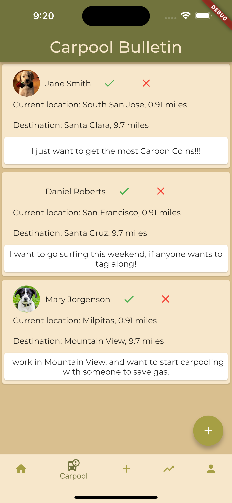
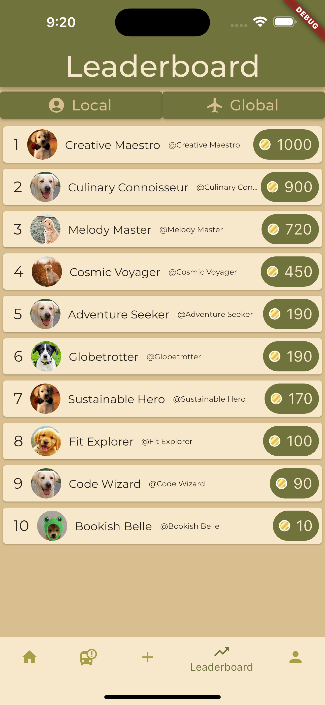
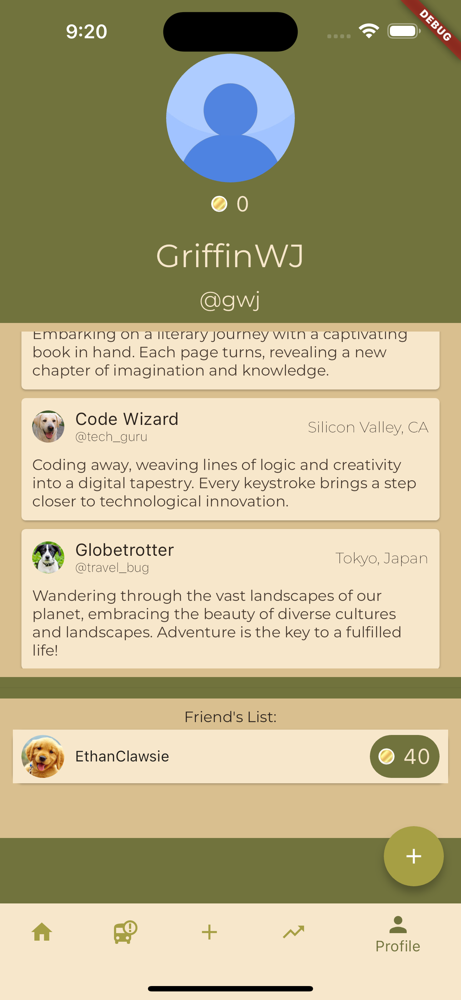
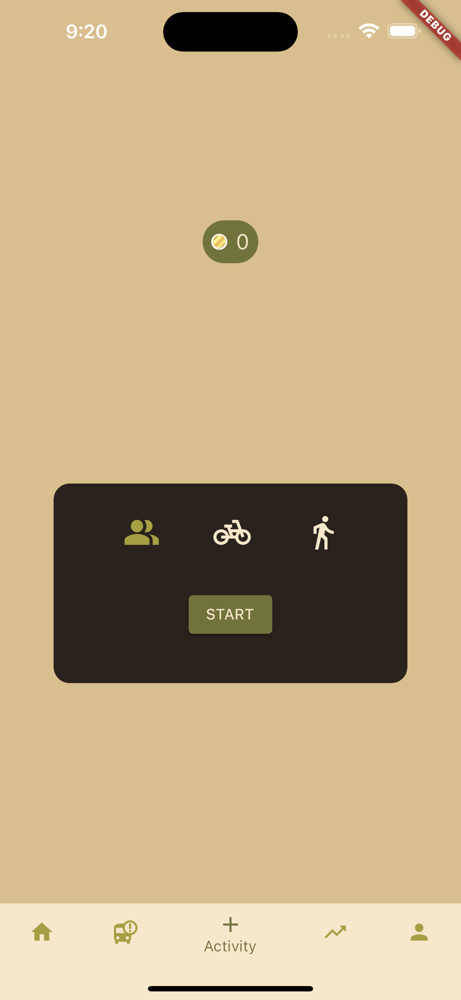
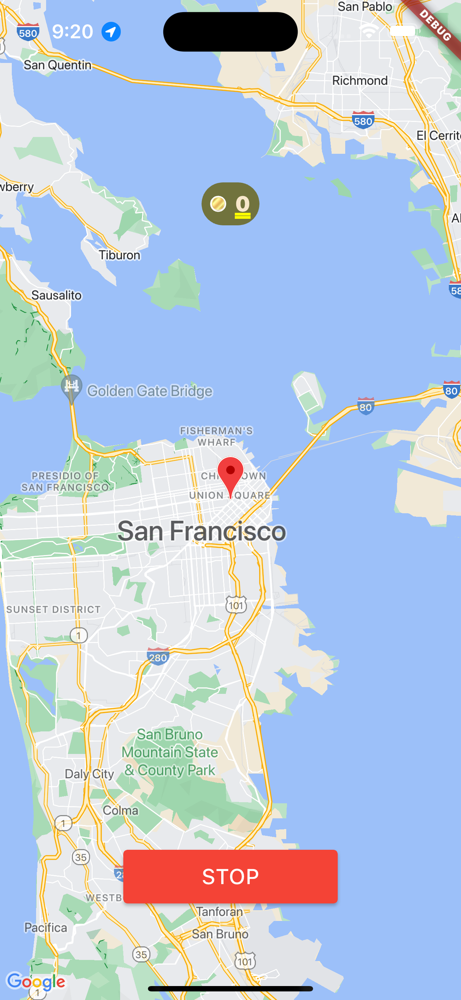

# Carbon

(This is a fork of the actual repo, [here](https://github.com/GriffinWJones/Carbon). It's set up this way, because our workflow benefitted from primarily sharing files over managing git branches, and as such, I otherwise wouldn't be listed as a contributer on the actual repo. In particular, I worked on API things like lib/map_display.dart, lib/get_distance.dart, as well as general Frontend / Backend / UX problems and necessities.)

## Screenshots

     

## Inspiration
We wanted to create an innovative product that has the capability of amassing huge amounts of attention, as well as contributing towards a better environment and implementing INRIX API. We were inspired by Strava's system of an activity feed that displays activity posts from your friends, as well as yourself.

## Learnings
We learned how to work in a team using GitHub and many of us learned how to use Flutter for the first time. We also gained a better understanding of how to connect frontend and backend aspects.

## Challenges
We had issues with git merge conflicts and our original database SQLite. It took many hours for us to finally start a system that worked because of these problems. We also had trouble integrating the front end to the back end.

## Technologies Used
- **Flutter** - Frontend
  - Flutter was used for front-end development, utilizing its large widget library for a functional and refined application interface
- **Supabase** - Database
  - Managed authentication, database, and storage
  - Initially used SQLite, then switched to Supabase for its cloud database capabilities
- **INRIX API** - Routing
  - Used to display distance from carpool requests and track alternative travel methods
- **Google Maps API** - Mapping
  - For displaying maps within the application
